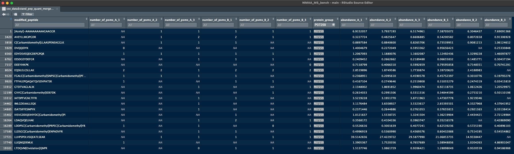
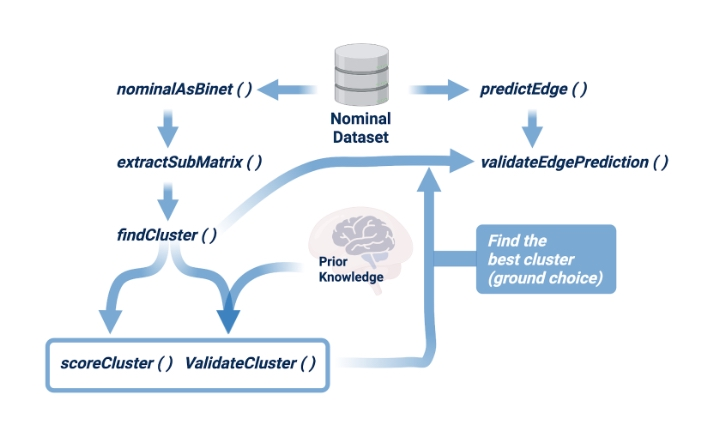

---
title: "EDA of WOMBAT-P Proteomics Data"
output: html_document
author: Ehsan Zangene
---

```{r setup, include=FALSE}
knitr::opts_chunk$set(echo = TRUE, warning = FALSE, message = FALSE)
```

## 📦 Load Required Libraries

```{r}
rm(list = ls())

library(jsonlite)
library(readr)
library(purrr)
library(tibble)
library(tidyverse)
library(ggplot2)
```

## 📁 Define Data Directory and Read Files

```{r}
data_dir <- "../../WOMBAT-P_Processed/ProteoBenchDDA/0.9.11/"

# List all files
all_files <- list.files(data_dir, full.names = TRUE)

# Split by type
csv_files <- all_files[grepl("\\.(csv)$", all_files)]
json_files <- all_files[grepl("\\.(json)$", all_files)]

# Read files
csv_data <- setNames(lapply(csv_files, read_csv), basename(csv_files))
json_data <- setNames(lapply(json_files, fromJSON), basename(json_files))
```

## 🧾 Function to Print Metadata

```{r}
print_metadata <- function(data_list, type = "CSV") {
  cat("\n===== Metadata for", type, "files =====\n")
  for (name in names(data_list)) {
    cat("\n---", name, "---\n")
    df <- data_list[[name]]
    if (is.data.frame(df)) {
      cat("Dimensions:", paste(dim(df), collapse = " x "), "\n")
      cat("Column names:", paste(colnames(df), collapse = ", "), "\n")
      cat("First few row names / IDs:", paste(rownames(df)[1:min(5, nrow(df))], collapse = ", "), "\n")
    } else {
      cat("Not a data frame. Type:", class(df), "\n")
      cat("length is: ", length(df), "\n")
      cat("including: ", names(df), "\n")
    }
  }
}
```

## 📄 Print Metadata


```{r}
csv_data_log <- csv_data$stand_ion_quant_mergedcompomics.csv %>%
  mutate(across(starts_with("abundance_"), ~log2(.x + 1)))  # add 1 to avoid log(0)

csv_data_log %>% 
  select(starts_with("abundance_")) %>% 
summary()
```
```{r}
tibble(csv_data$stand_ion_quant_mergedcompomics.csv) %>% 
  select(starts_with("abundance_")) %>% 
  summary()

```

```{r}
# Pivot to long format
for (i in (grep("stand_pep_quant",names(csv_data)))){
  tmptbl = NULL
  df_long = NULL
  # head(tibble(csv_data[[i]]))
  tmptbl <- csv_data[[i]]
  
  df_long <- tmptbl %>%
  pivot_longer(
    cols = starts_with("abundance_"),
    names_to = "sample",
    values_to = "abundance"
  )  

  p1 <- ggplot(data = df_long, aes(x = sample, y = abundance, fill = sample)) +
      geom_boxplot(alpha = .7) +
    # coord_flip() +
    theme_minimal() +
    theme(axis.text.x = element_blank(),
          axis.ticks.x = element_blank(),
          legend.position = "none")
  
  # 
  # df_long <- df_long %>% 
  #   mutate(across("abundance", ~log2(.x + 1)))

  p2 <- ggplot(data = df_long, aes(x = sample, y = log2(abundance + 1), fill = sample)) +
      geom_boxplot(alpha = .7) +
    # coord_flip() +
    theme_minimal() +
    theme(axis.text.x = element_text(angle = 45, hjust = 1),
          legend.position = "none")

  # legend <- cowplot::get_legend(p1)
  # p1 <- p1 + theme(legened.position = "none")
  p <- cowplot::plot_grid(p1, p2, ncol = 1, labels = gsub("stand_pep_quant_","",names(csv_data[i])))
    print(p)
}
# 
# 
# csv_data_log %>%
#   pivot_longer(cols = starts_with("abundance_"), names_to = "sample", values_to = "log2_abundance") %>%
#   ggplot(aes(x = sample, y = log2_abundance)) +
#   geom_boxplot(outlier.shape = NA) +
#   coord_flip() +
#   theme_minimal()
# 
# 
# print_metadata(csv_data, "CSV")
# print_metadata(json_data, "JSON")
```
# question: why some peps have no psm mapped but on the other hand there some abundance values (to ve asked form fight)
## e.g. P07259 in maxquant pep csv psm vs abundance


## 📊 Sample Exploratory Plots from CSV (if applicable)

```{r df_4_NIMAA func def}
# to use this func first we need an additonal func to let the user chose the column for rownames and columns that need to stay as the cols
# and also rm the duplicated var chosen for rownames with some logic (least NA including)

source("../script/funcs4_nimaa_analysis.R") 
# if (length(csv_data) > 0) {
#   sample_df <- csv_data[[1]]
#   if (is.data.frame(sample_df)) {
#     summary(sample_df)
#     hist_df <- sample_df[, sapply(sample_df, is.numeric)]
#     if (ncol(hist_df) > 0) {
#       hist(hist_df[[1]], main = "Histogram of first numeric column", xlab = names(hist_df)[1])
#     }
#   }
# }
```

## NIMAA analysis on NA's of WomBat datasets


```{r NIMAA}
library(NIMAA)

# nominalAsBinet()

# beatAML is a long format dataset existing NIMAA
# beatAML_data <- NIMAA::beatAML[1:1000,]

# convert to incidence matrix or actually the wide format of real data
# beatAML_incidence_matrix <- nominalAsBinet(beatAML_data)

# extract submatrices with non-missing values
# sub_matrices <- extractSubMatrix(beatAML_incidence_matrix, col.vars = "patient_id",
#  row.vars = "inhibitor")
seqq = (grep("stand_prot_quant",names(csv_data)))

for (i in seqq){
  print(i)
  tmptbl = NULL
  df_long = NULL
  # head(tibble(csv_data[[i]]))
  rm(nm)
  nm <- names(csv_data[i])
  tmptbl <- csv_data[[i]]
  cat("dataset name: ", nm, " ----- dim: ", dim(tmptbl), " \n")
  # print(colnames(tmptbl))
  read4_nimaa <- df_4_NIMAA(tmptbl, column_to_row = "protein_group", if_protein = T, pattern_to_columns = c("peptides_A", "peptides_B"),
                            No_rows = 1000) 
  print(class(read4_nimaa))
  print(dim(read4_nimaa))
  print(head(read4_nimaa))
  print(rownames(read4_nimaa)[1:10])
  cat("--------> done: ", nm, paste(rep("-------",3), collapse = ""), "\n")
}
```
```{r}
subMat_bench = NULL
for (i in seqq){
  tmptbl = NULL
  
  rm(nm)
  nm <- names(csv_data[i])
  tmptbl <- csv_data[[i]]
  
  not_ready_df <- tmptbl
  # read4_nimaa <- df_4_NIMAA(not_ready_df,"peptide", c("abundance_A", "abundance_B"))
  read4_nimaa <- df_4_NIMAA(tmptbl, column_to_row = "protein_group", if_protein = T, pattern_to_columns = c("peptides_A", "peptides_B"),
                            No_rows = 500)
  
  subMat <- NULL
  # extract submatrices with non-missing values
  cat("--------> dataset name: ", nm, "-------> iteration: ", i, "\n")
  subMat <- extractSubMatrix(read4_nimaa, col.vars = "samples", row.vars = "peptide")
  subMat_bench[[nm]] <- subMat
  
  cat("--------> done: ", nm, paste(rep("-------",3), collapse = ""), "\n")
}
```

